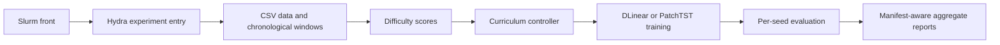

# Code architecture

This page explains how the curriculum treatment travels from a Slurm launch to
an analyzed report. The mathematical definition is in
[`method_overview.pdf`](../latex/method_overview.pdf).

## Scientific path

| Owner | Responsibility | Main outputs |
|---|---|---|
| `src/data/` | CSV loading, target splits, windows, and stable user identities | Training and evaluation samples |
| `src/curriculum/` | Difficulty scores, phase schedule, active-user controller, and exposure-matched probabilities | Ordered users and phase sampling policy |
| `src/external_models/` | Pinned DLinear and PatchTST implementations | Backbone tensors |
| `src/model_loading/` | Backbone construction and shared normalization composition | Configured forecaster |
| `src/training/` | Fixed-step fitting and per-user evaluation | Seed histories and metrics |
| `src/results/` | Completed-run selection and aggregation | Tables and report manifests |

The proposal is isolated in `src/curriculum/`. It does not know about Hydra,
Slurm, manifests, or plotting. The training loop asks the controller for the
active user distribution at the current optimizer step; changing phase never
restarts the model or optimizer.

## Execution path

1. `curriculum.slurm` or `curriculum_selena.slurm` selects a scale profile.
2. `src/slurm/run_curriculum_experiment.sh` expands datasets, settings,
   backbones, methods, and seeds.
3. `src/scripts/experiment.py` resolves one Hydra configuration.
4. The run manifest allocates or resumes the exact configuration.
5. The curriculum controller changes only the sampling population.
6. The table stage reads completed manifests and writes
   `outputs/reports/curriculum/<mode>/`.

## Important boundaries

- Difficulty uses training windows only.
- All methods share initialization, optimizer budget, batch size, and evaluation.
- External backbone packages are not modified by curriculum logic.
- A seed controls every stochastic choice in its repetition.
